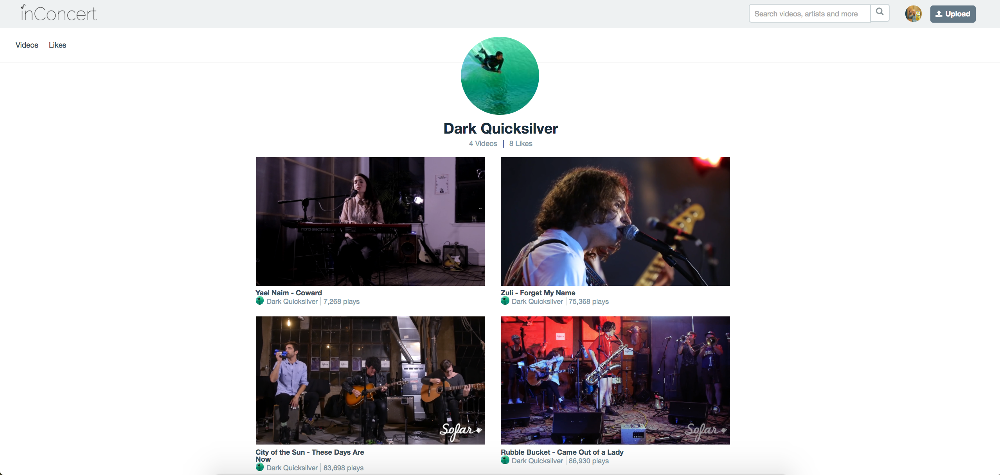
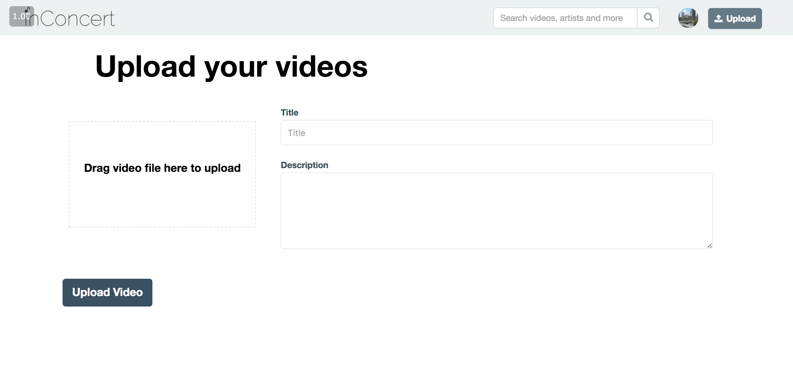
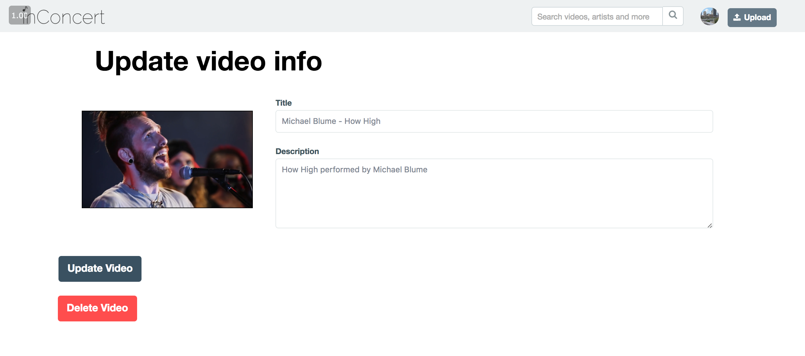
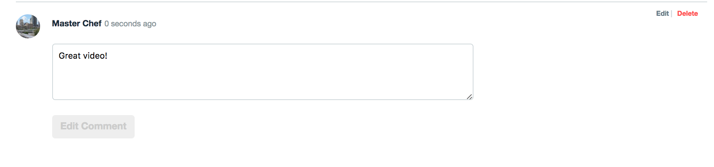
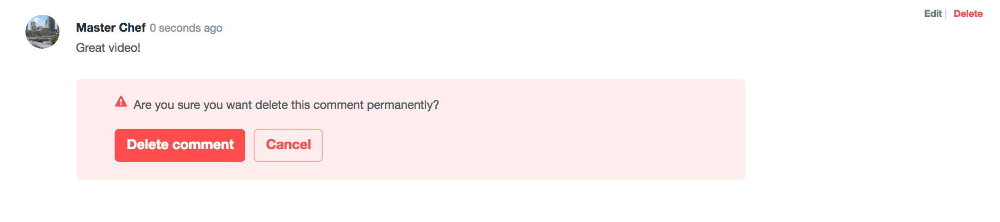
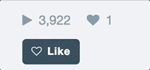
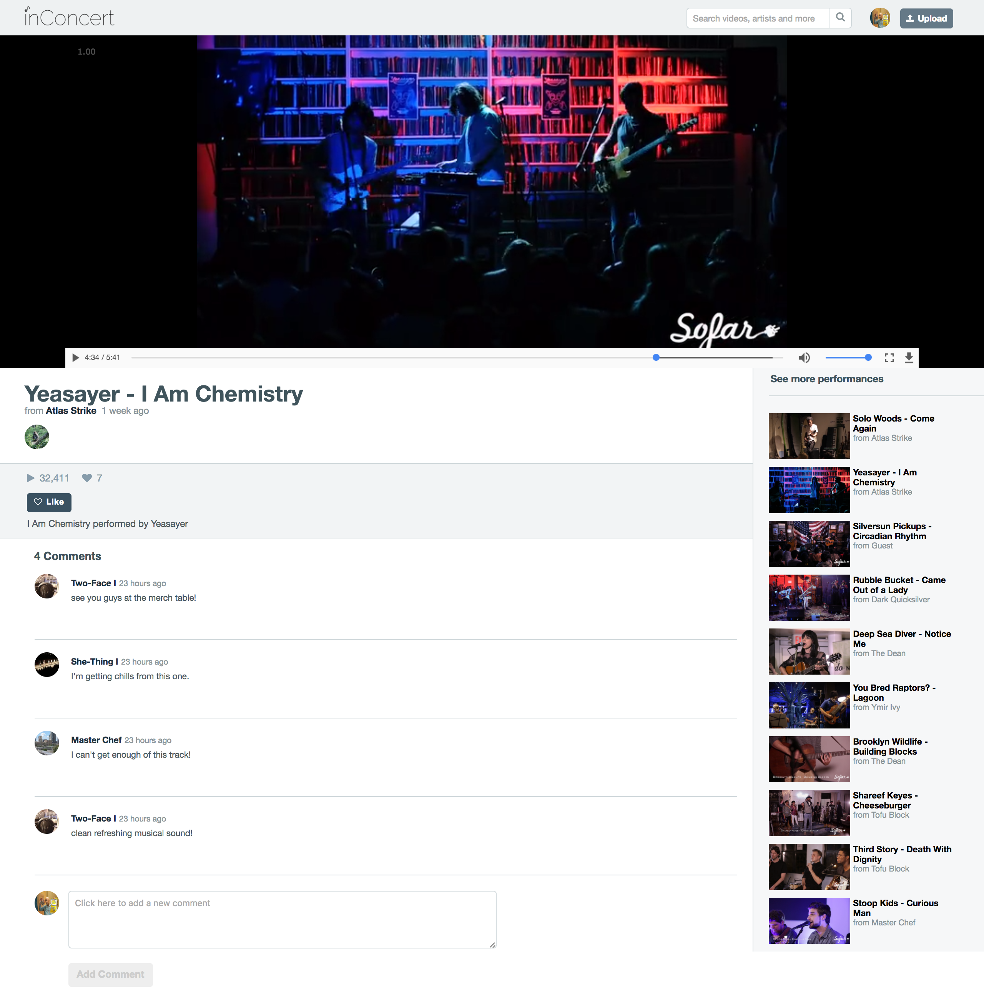

# inConcert

[Live]

[live]: http://www.liveinconcert.co


inConcert is a web application inspired by Vimeo, with a musical twist, built using Ruby on Rails and React/Redux. The database is seeded with my favorite videos produced by the live audio/visual team of Sofar Sounds New York where I worked as a videography lead for two years.

## Features and Implementation

### Users

  Users are able to create an account to start uploading videos, writing comments and liking other videos.
A demo account is provided to those who want to test inConcert's features without signing up for a new account. Users are stored in a database table containing their `id`, `username`, `password_digest`, `avatar` and `session_token`. User avatars are stored on AWS and attached to the User model via Paperclip. Users can visit their profile to see an index of videos that they either uploaded or liked by utilizing the `videos` and `liked_videos` database associations written on the User model. Jbuilder views allows us to carry this curated data over to the front-end.



```ruby
_user.json.jbuilder

json.set! :videos do
  json.array! user.videos do |video|
    json.id video.id
    json.user_id video.user_id
    json.title video.title
    json.views video.views
    json.thumbnail_url asset_path(video.thumbnail.url)
    json.upload_date video.created_at.to_date
  end
end

json.set! :liked_videos do
  json.array! user.liked_videos.uniq do |video|
    json.id video.id
    json.user_id video.user_id
    json.title video.title
    json.views video.views
    json.thumbnail_url asset_path(video.thumbnail.url)
    json.upload_date video.created_at.to_date
  end
end
```

### Videos

  Users can upload, watch, update and delete videos to inConcert. Each video is stored in the database with an `id`, `title`, `description`, `videoitem`, `thumbnail`, `views`, and `user_id`. Videos and thumbnails are attached to model using the paperclip gem and stored on AWS.

  Users can simply upload a video file by dragging and dropping it into the file drop zone created using the `npm` package `react-dropzone`. A successful file drag-and-drop automatically generates a thumbnail so that users do not have to manually upload it themselves. Video thumbnail generation was achieved by loading a blob preview of the video in the background and using Canvas to capture a frame, which is then appended to the upload parameters.

  

  

  ```javascript
  video_form.jsx

  extractFrame(files) {

    let video = document.getElementById('video-preview')
    let canvas = document.getElementById('canvas')
    let ctx = canvas.getContext('2d');

    function initCanvas(e) {
      canvas.width = this.videoWidth;
      canvas.height = this.videoHeight;
    }

    function drawFrame(e) {
      this.pause();
      ctx.drawImage(this, 0, 0);
      document.getElementById('preview-thumbnail').src = canvas.toDataURL();
    }

    video.autoplay = true;
    video.muted = true;

    video.addEventListener('loadedmetadata', initCanvas, false);
    video.addEventListener('loadeddata', drawFrame, false);

    video.src = URL.createObjectURL(files[0]); //generate preview to extract from user loaded file
    video.src += "#t=15"; //generate thumbnail at 15 seconds
  }
  ```

  Users are re-directed to their new video's show page, where other users can like or comment the video and the view count increments by 1 with each visit. Videos are streamed using the `npm` package `ReactPlayer`. Uploaders also have the option to edit their video's title and description or delete the video entirely through the video's edit form. Uploads and updates are handled by the same function:

  ```javascript
  export const processVideoForm = (formData, id = "") => {
    let url;
    let method;

    if(id === ""){
      url = "api/videos";
      method = "POST"
    } else {
      url = `api/videos/${id}`
      method = "PATCH"
    }
    return $.ajax({
      method,
      url,
      processData: false,
      contentType: false,
      dataType: 'json',
      data: formData
    })
  }
  ```

### Commenting on videos

Users can submit comments to videos and then have the option to edit and delete their comments. Comments are stored in a database table with their `id`, `body`, `video_id`, and `user_id`. Custom front-end validations ensure users cannot submit blank comments and can only edit and delete their own comments.

Comment Edit form:



Comment Delete:


```javascript
comment_form.jsx

renderSubmit(){
  if(this.state.body.length > 0){
    return(
      <div>
        <input type="submit" id="add-comment" value="Add Comment"/>
        <br></br>
      </div>
    )
  } else {
    return (
      <div>
        <input type="submit" id="add-comment-disabled" value="Add Comment" disabled/>
        <br></br>
      </div>
    )
  }
}
```

```javascript
comment_item.jsx

//onMouseOver
showCommentSettings(event){
  if(this.props.currentUser){
    if(this.props.currentUser.id === this.props.comment.user_id){
      this.setState( {commentSettings: true } )
    }
  }
}

//onMouseOut
hideCommentSettings(event){
  this.setState( { commentSettings: false } )
}
```

### Liking videos



Users can like a video. The like instance is then stored in the database with an `id`, `user_id` and `video_id`, allowing us to load a user's `liked_videos`. Likes are an easy way for the user to bookmark videos that they enjoy and want to watch again. A like button is only rendered on the video show page when a user is logged in. To prevent overlapping requests from a user clicking too fast, the button is disabled in the brief moment a like/unlike request is being handled. Video show tracks this moment in its state and it is reset in the promise returned by the completed request.

### Video Search

Users can search a video by title by using the search bar in the navigation bar. A search API call is made upon submitting the query. Once the query hits the controller, the query parameters are passed into a SQL query that checks for videos with a title or description containing any one of the query strings passed in. Search results are then rendered as video items with their thumbnail, title, views.


```ruby
video.rb

def self.search_videos(filter)

  if filter[:query]
    search_strings = filter[:query].split(" ").map { |string| "%#{string}%" }
    where_string = ""
    search_string_array = []
    while search_strings.length > 0
      where_string = where_string + " OR " if where_string.length > 0
      string = search_strings.pop
      where_string = where_string + "UPPER(title) LIKE UPPER(?)"
      search_string_array << string
    end

    query = Video.where(where_string, *search_string_array).includes(:user)
  else
    query = Video.where(seeded: true) //only fetch videos seeded by the administrator
  end

  query
end

```

## Languages, Frameworks, Libraries

* [Ruby on Rails]
* [PostgreSQL]
* [React.js]
* [Redux]
* [jQuery]
* Gems
  * [Paperclip]
  * [Paperclip AV Transcoder]
  * [Amazon Web Services SDK]
  * [Jbuilder]
  * [BCrypt]
  * [Figaro]
* NPM packages
  * [Nuka Carousel]
  * [Halogen]
  * [React Timeago]
  * [React Player]
  * [React Dropzone]
  * [React Masonry]
  * [React Scroll]

[Ruby on Rails]: http://rubyonrails.org/
[PostgreSQL]: https://www.postgresql.org/
[React.js]: https://facebook.github.io/react/
[Redux]: http://redux.js.org/
[jQuery]: https://jquery.com/
[Paperclip]: https://github.com/thoughtbot/paperclip
[Paperclip AV Transcoder]: https://github.com/ruby-av/paperclip-av-transcoder
[Amazon Web Services SDK]: https://github.com/aws/aws-sdk-ruby
[Jbuilder]: https://github.com/rails/jbuilder
[BCrypt]: https://github.com/codahale/bcrypt-ruby
[Figaro]: https://github.com/laserlemon/figaro
[Nuka Carousel]: https://github.com/FormidableLabs/nuka-carousel
[Halogen]: https://github.com/yuanyan/halogen
[React Timeago]: https://www.npmjs.com/package/react-timeago
[React Player]: https://github.com/souporserious/react-media-player
[React Dropzone]: https://github.com/okonet/react-dropzone
[React Masonry]: https://github.com/eiriklv/react-masonry-component
[React Scroll]: https://github.com/fisshy/react-scroll

## Additional Screenshots


Home Index:


Video show page:

